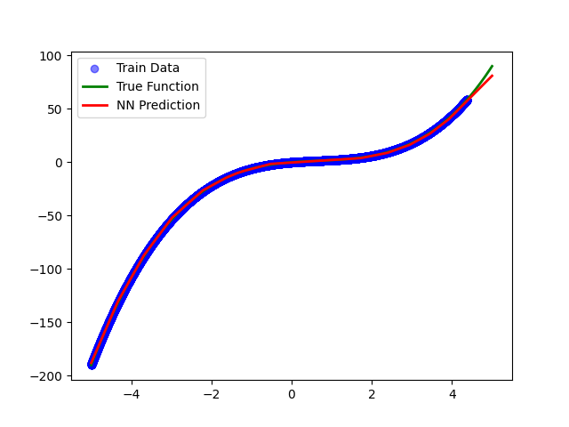

## 说明报告

### 函数说明
实验使用一个函数定义目标有界闭集函数。函数读入自变量x，输出函数结果。之后通过这个函数进行数据集采样。
```python
def target_function(x):
    """ 目标有界闭集函数 """
    return x ** 3 - 2 * x ** 2 + 3 * x
```

### 数据采集
本实验通过指定采样上下界和采样点数进行均匀采样。采样得到的输入x和真值y_true的维度都是`[点数， 1]`
```python
# **采样数据**
x = np.linspace(-5, 5, 16384).reshape(-1, 1)
y_true = target_function(x)
```

采样后进行数据集划分。后1024个数据不在测试集中出现。测试时，为了综合衡量模型的泛化能力和在训练集上的拟合能力，将两部分数据都用于测试。
```python
# **划分数据集**
x_train, y_train = x[0:-1024], y_true[0:-1024]  # 训练集
x_test, y_test = x, y_true  # 全部数据用于测试
```

### 模型描述
本实验使用numpy进行实现。网络结构设计为一个双层前馈神经网络，包含两次仿射变换。同时记录设定的梯度裁剪阈值，防止梯度爆炸。
```python
class MyFNN:
    def __init__(self, input_dim, hidden_dim, output_dim, learning_rate=0.01, clip_value=1.0):
        self.lr = learning_rate
        self.clip_value = clip_value  # 梯度裁剪阈值, 不然容易梯度爆炸
        self.W1 = np.random.randn(
            input_dim, hidden_dim) * np.sqrt(2 / input_dim)
        self.b1 = np.zeros((1, hidden_dim))
        self.W2 = np.random.randn(
            hidden_dim, output_dim) * np.sqrt(2 / hidden_dim)
        self.b2 = np.zeros((1, output_dim))
```

实现激活函数和激活函数的导数。实现损失函数。实现后续测试时推理的函数
```python
    def relu(self, x):
        """ ReLU 激活函数 """
        return np.maximum(0, x)

    def relu_derivative(self, x):
        """ ReLU 的导数 """
        return (x > 0).astype(float)

    def loss(self, y_pred, y_true):
        """ 计算均方误差 (MSE) """
        return np.mean((y_pred - y_true) ** 2)

    def predict(self, x):
        """ 预测 """
        z1 = np.dot(x, self.W1) + self.b1
        a1 = self.relu(z1)
        z2 = np.dot(a1, self.W2) + self.b2
        return z2
```

实现模型的训练过程。对于每个epoch，先打乱数据，然后根据传入的batch_size进行切分。对于每个batch的数据，先进行前向推理，然后根据推理结果计算损失函数，之后手动逐层计算梯度并更新参数。
```python
    def train(self, x_train, y_train, epochs=5000, batch_size=32, verbose=True):
        """ 训练 """
        n_samples = x_train.shape[0]
        for epoch in range(epochs):
            # 打乱数据
            indices = np.arange(n_samples)
            np.random.shuffle(indices)
            x_train = x_train[indices]
            y_train = y_train[indices]

            for start_idx in range(0, n_samples, batch_size):
                end_idx = min(start_idx + batch_size, n_samples)
                x_batch = x_train[start_idx:end_idx]
                y_batch = y_train[start_idx:end_idx]

                # 前向传播
                z1 = np.dot(x_batch, self.W1) + self.b1
                a1 = self.relu(z1)
                z2 = np.dot(a1, self.W2) + self.b2
                y_pred = z2

                # 计算损失
                loss = self.loss(y_pred, y_batch)

                # 反向传播
                dL_dy = 2 * (y_pred - y_batch) / y_batch.shape[0]
                dL_dW2 = np.dot(a1.T, dL_dy)
                dL_db2 = np.sum(dL_dy, axis=0, keepdims=True)

                dL_da1 = np.dot(dL_dy, self.W2.T)
                dL_dz1 = dL_da1 * self.relu_derivative(z1)
                dL_dW1 = np.dot(x_batch.T, dL_dz1)
                dL_db1 = np.sum(dL_dz1, axis=0, keepdims=True)

                # **梯度裁剪**
                dL_dW2 = np.clip(dL_dW2, -self.clip_value, self.clip_value)
                dL_db2 = np.clip(dL_db2, -self.clip_value, self.clip_value)
                dL_dW1 = np.clip(dL_dW1, -self.clip_value, self.clip_value)
                dL_db1 = np.clip(dL_db1, -self.clip_value, self.clip_value)

                # **参数更新**
                self.W2 -= self.lr * dL_dW2
                self.b2 -= self.lr * dL_db2
                self.W1 -= self.lr * dL_dW1
                self.b1 -= self.lr * dL_db1

            if verbose and epoch % 1000 == 0:
                print(f"Epoch {epoch}, Loss: {loss:.5f}")
```

### 拟合效果
运行代码，可以看到神经网络较好的拟合了目标函数。在这一区间上，MSE为：`Test MSE: 1.71185`

